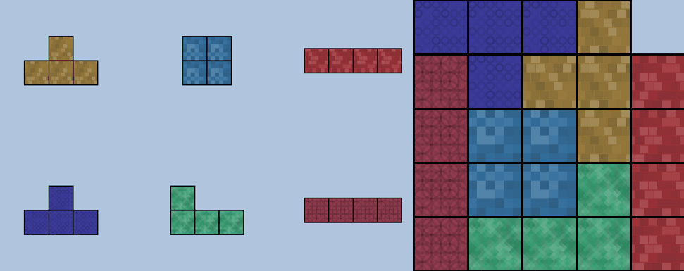

# pack_poly

CSCI 1710 Project - Polyomino Packing (in Z3)

Group: Aditya Ganeshan, Arman Maesumi

## Model Overview

Before creating Z3 constraints, we first needed to decide on a polyomino representation (i.e. how we represent a single polyomino). We chose to canonicalize the polyominoes (keeping one tile at the origin (0,0)), then represent the piece structure using integer offsets from the origin, i.e. (+1, -2). Rotation flags for angles 0, 90, 180, 270 degrees are represented using a BitVec of size 2. Additionally, we represent the container as a 2D array of boolean values. Note, we do not allow reflections in the pieces!

Our Z3 model uses these representations to enforce the following constraints;
for all polyominoes with respect to their locations and rotations, we ensure they are:
1. Placed inside container
2. Non-overlapping
3. Not placed on blocked cell

We also optionally experiment with two other constraints A) requires that all board tiles are filled B) requires that all polyominoes have been placed. These constraints are useful for different packing tasks. For instance, "A" is useful for exact cover tasks; whereas if you have a surplus of polyominoes (all polyominoes cannot fit in the container), then you would disable "B".

>

>Figure 1. An example instance of an 8x8 board with four (white tiles) that are "blocked." We pack the container using the set of canonical pentaminoes.

We define the Z3 model and solving routine in `./packing/packing.py`

## Verification / Property-based Testing

In order to test the validity of our model, we procedurally produce random packing configurations using 2D CSG programs. The procedural algorithm greedily places (with rejection) random polyominoes on a discrete canvas. The process terminates after too many rejections or a fixed number of placements occur.

By construction, these procedurally generated polyomino configurations are guaranteed to have a solution, so we check validity simply by running our model on these configurations.

All procedural generation code is located in `./generator/`

## Investigation of Packing Stability

We investigated the notion of "stability" in polyomino packing configurations. For a given configuration (a set of polyominoes and a fixed container), we measure stability by asking: "if we introduce noise to the set of polyominoes, does the configuration remain packable?" More concretely, for the given set of polyominoes, we measure the probability that the configuration remains packable after a single piece has been randomly swapped out for another piece. We hope to discover polyomino sets that are more robust against noisey perturbation. This problem is motivated in our presentation, we spare those details in this write-up.

We first compute packings (if they exist) for all combinations with replacement of the given set of polyominoes with respect to a fixed container. We then compute stability scores for each combination by enumerating its neighboring combinations (polyomino sets with distance `K` from the original set).

>

> Figure 2. This GIF demonstrates a given polyomino set that is particularly stable: it is packable even with small perturbations in the available pieces. This configuration was identified by our model.

The code for computing stability can be found in `./stability.py`. The computation of packings over all combinations was done in parallel on the CCV Oscar cluster using 32 cores.

### Hypothesis testing regarding stability

One question we asked was, how does stability change as `K` increases? `K` corresponds to the amount of noise introduced to the original polyomino configuration, we hypothesized that stability should decrease as `K` increases. We found a counter example to this hypothesis using Z3; however, it seems that this property *usually* holds, but not always. Details are presented in the final presentation, we share a result of this hypothesis here:

>

> Figure 3. This packing was found as a counter example to our hypothesis. The above configuration has the following stability: Stability(K=1): 0.583, Stability(K=2): 0.868, Stability(K=3): 0.734, Stability(K=4): 0.490. We see that `K=2` offers higher stability than, say, `K=1`.

>

> Figure 4. We see that our hypothesis is true in the *average* case. We plot the average stability values over all combinations for varying values of `K`.

---

# Old README:

## Project Description

Following our curiosity modeling project, we are setting out to model polymino packing. Polyminoes are generalized tetriminoes (Tetris pieces)—i.e. shapes that are formed by connecting N squares together edge to edge. The prototypical instance of a problem statement in our model is: “Given an arbitrary 2D container (a Tetris board in an arbitrary shape) and a set of polyominoes, how can I arrange the polyominoes to fill the container?” Polymino packing is an interesting and challenging problem in computational geometry and discrete mathematics, which involves solving a combinatorial optimization problem that is NP-complete. The problem is connected to various real-world applications, namely manufacturing and logistics, where efficiently packing different objects in a limited space is of relevance. This problem also offers several avenues for exploration: we can impose additional constraints such as assigning a color to each polymino, then enforcing that the packing solution does not have any of the same colors touching each other (turning it into a packing-coloring problem). We also note the existence of a “dual” problem, where we are given a container and a set of sheets of material, and the goal is to find the minimum cost cut that produces a set of polyminoes that fills the container.

## Foundation Goals

1. Create a system which can solve the packing problem for tetriminoes for arbitrary shape containers.

2. Create a system which can solve the packing problem for arbitrary order polyminoes with a fixed rectangular container.

## Target Goals

1. Map arbitrary instances of the polymino packing problem to SAT instances and solve them with appropriate packages.

2. Solve reasonably complex instances of these problems Investigate additional constraints such as polymino coloring

## Reach Goals

For our reach goals, we want to integrate the construction of polyminoes as a part of the problem statement. This system starts with a given container, and a material block. Now the system must "cut" the polyminoes from the material block as well as pack them in the container. The goal would be to maximize packing, while minimizing the number of cuts required (for example, by making many polyminoes with a single cut). Our system will output a pareto boundary of "feasible" solutions with different packing-cutting tradeoffs.
